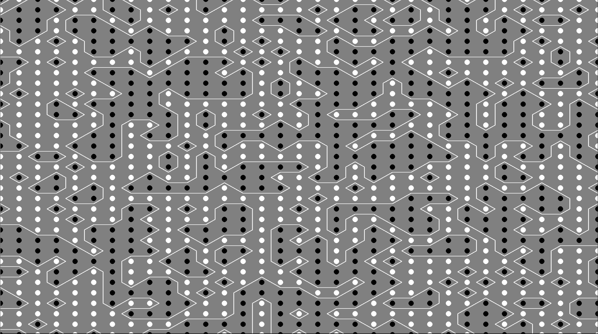
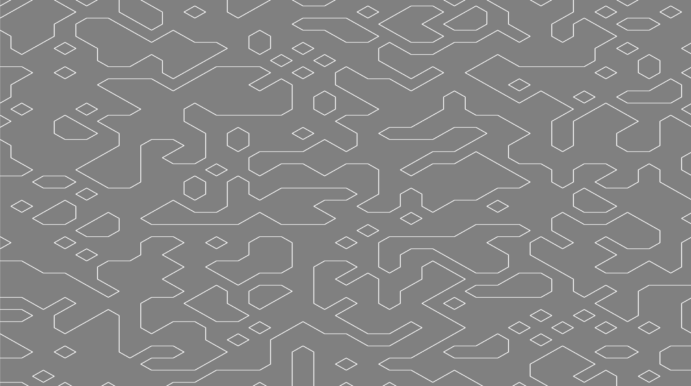
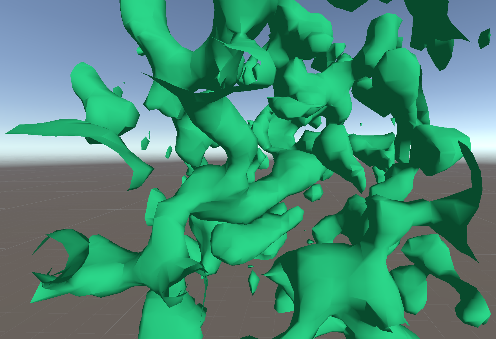
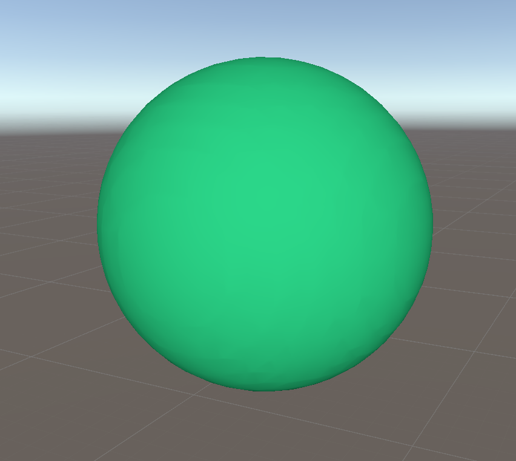

## Marching cubes

This project contains the implementation of the Marching squares and Marching cubes algorithms.

### Marching squares

This is a simple implementation of the marching squares algorithm. The algorithm is written in a compute shader and it uses a noise Texturer3D uniform variable along with the grid size. 

Since, the produced noise is a 3D texture the depth variable represents a time slice.

### Marching cubes

This is an implementation of the marching cubes algorithm, written in a compute shader. The compute shader requires a 3D noise texture, the size of the area that will contain the mesh and the grid size.

This is the generated mesh using a random 3D noise texture.

This is the generated mesh using a sphere noise texture.

### Sources

- [Polygonising a scalar field](https://paulbourke.net/geometry/polygonise/)
- [Noise generation](https://thebookofshaders.com/11/)