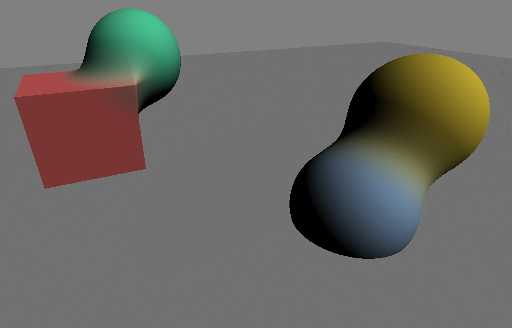

## Ray marching

This project implements a simple ray marching demo using sphere-assisted ray marching. It renders spheres and cubes using their SDF (Signed Distance Function) and blends them together using a smooth min function.

### Sources

- [Smooth min functions](https://iquilezles.org/articles/smin/)